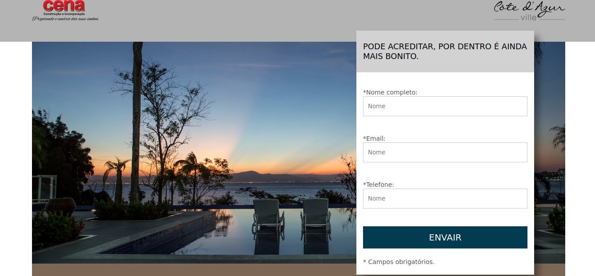
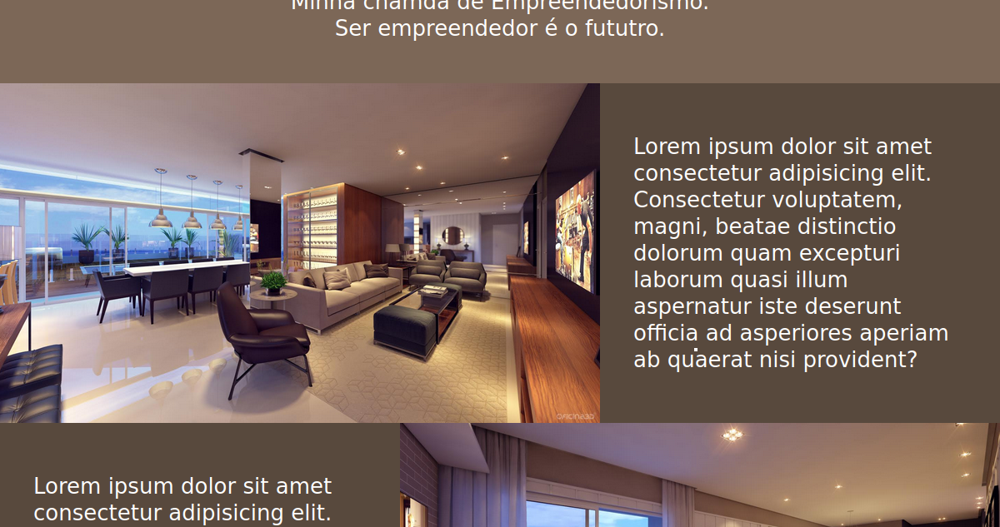
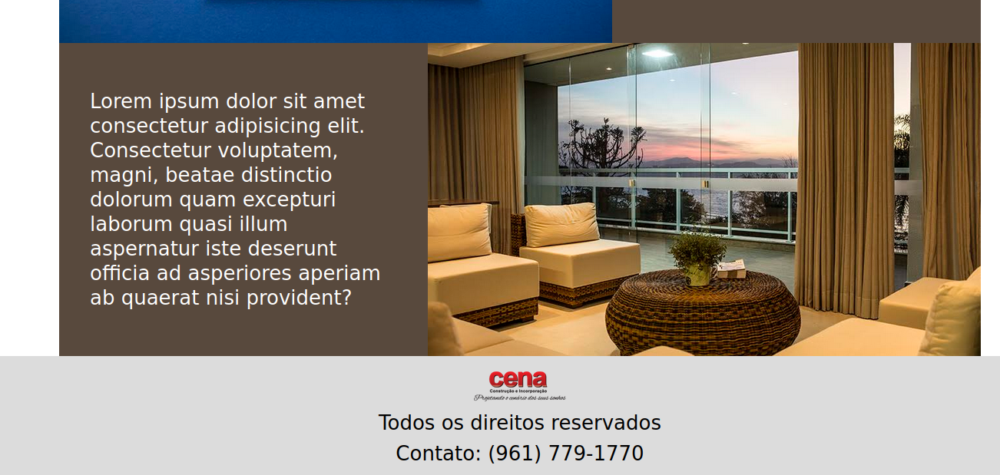

# Site simples sobre cena
### site feito com objetivo de estudos

## Pré visus






# HTML
```
    <!DOCTYPE html>
<html lang="pt-BR">
<head>
    <meta charset="UTF-8">
    <meta name="viewport" content="width=device-width, initial-scale=1.0">
    <meta name="description" content="Descrição do meu site">
    <meta name="keywords" content="palavras, chave, separadas, por, virgula">
    <meta name="author" content="DevSozinho - DankiCode">
    <title>Projeto Cena Site/landing page</title>
    <link rel="stylesheet" href="css/style.css">
    <link href="https://fonts.googleapis.com/css?family=Open+Sans" rel="stylesheet">
    <link rel="stylesheet" href="https://cdn.jsdelivr.net/npm/bootstrap-icons@1.10.5/font/bootstrap-icons.css">
</head>
<body>
    <header>
        <div class="container">
            <div><div class="logo-1"></div><!--Logo-1--></div>
            <div><div class="logo-2"></div><!--Logo-2--></div>
            <div class="clear"></div><!--Clear-->
        </div><!--Container-->
    </header>

    <section class="cover-form">
        <div class="container bg">
            <div class="form-container">
                <h2>PODE ACREDITAR, POR DENTRO É AINDA MAIS BONITO.</h2>
                <form action="">
                    <div class="form-wraper">
                    <p>*Nome completo:</p>
                    <input type="text" name="nome" id="nome" required placeholder="Nome">
                </div><!--Form-wraper-->

                <div class="form-wraper">
                    <p>*Email:</p>
                    <input type="email" name="email" id="email" required placeholder="Nome">
                </div><!--Form-wraper-->

                <div class="form-wraper">
                    <p>*Telefone:</p>
                    <input type="tel" name="tel" id="tel" required placeholder="Nome">
                </div><!--Form-wraper-->

                <div class="form-wraper">
                    <input type="submit" value="Envair" name="acao">
                </div><!--Form-wraper-->

                <div class="form-wraper">
                    <p>* Campos obrigatórios.</p>
                </div><!--Form-wraper-->
                </form>
            </div><!--Form-container-->
            <div class="clear"></div>
        </div><!--Container-->
    </section><!--Cover-form-->

    <section class="chamada">
        <div class="container">
        <h2>Minha chamda de Empreendedorismo.</h2>
        <p>Ser empreendedor é o fututro.</p>
    </div><!--Container-->
    </section><!--Chamada-->

    <section class="mosaico">
        <div class="container">
            <div class="flex-mosaico">
                <div class="item-1-mosaico">
                </div><!--Item-1-mosaico-->
                <div class="item-2-mosaico">
                    <p>Lorem ipsum dolor sit amet consectetur adipisicing elit. Consectetur voluptatem, magni, beatae distinctio dolorum quam excepturi laborum quasi illum aspernatur iste deserunt officia ad asperiores aperiam ab quaerat nisi provident?</p>
                </div><!--Item-2-mosaico-->
            </div><!--Flex-mosaico-->

            <div class="flex-mosaico">
                <div class="item-1-mosaico" style="background-image: url(img/mosaico2.jpg);">
                </div><!--Item-1-mosaico-->
                <div class="item-2-mosaico">
                    <p>Lorem ipsum dolor sit amet consectetur adipisicing elit. Consectetur voluptatem, magni, beatae distinctio dolorum quam excepturi laborum quasi illum aspernatur iste deserunt officia ad asperiores aperiam ab quaerat nisi provident?</p>
                </div><!--Item-2-mosaico-->
            </div><!--Flex-mosaico-->

            <div class="flex-mosaico">
                <div class="item-1-mosaico" style="background-image: url(img/mosaico3.jpg);">
                </div><!--Item-1-mosaico-->
                <div class="item-2-mosaico">
                    <p>Lorem ipsum dolor sit amet consectetur adipisicing elit. Consectetur voluptatem, magni, beatae distinctio dolorum quam excepturi laborum quasi illum aspernatur iste deserunt officia ad asperiores aperiam ab quaerat nisi provident?</p>
                </div><!--Item-2-mosaico-->
            </div><!--Flex-mosaico-->

            <div class="flex-mosaico">
                <div class="item-1-mosaico" style="background-image: url(img/mosaico4.jpg);">
                </div><!--Item-1-mosaico-->
                <div class="item-2-mosaico">
                    <p>Lorem ipsum dolor sit amet consectetur adipisicing elit. Consectetur voluptatem, magni, beatae distinctio dolorum quam excepturi laborum quasi illum aspernatur iste deserunt officia ad asperiores aperiam ab quaerat nisi provident?</p>
                </div><!--Item-2-mosaico-->
            </div><!--Flex-mosaico-->
        </div><!--Container-->
    </section><!--Mosaico-->


    <footer>
        <div></div>
        <p>Todos os direitos reservados</p>
        <p>Contato: (961) 779-1770</p>
    </footer>


</body>
</html>
```

# CSS
```
    *{
    padding: 0;
    margin: 0;
    box-sizing: border-box;
    font-weight: normal;
    font-family: 'OpenSans',sans-serif;
}
html,body{
    height: 100%;
}


/*================== CLEAR/GERAIS DIV ====================*/
.clear{clear: both;}

.container{
    width: 100%;
    max-width: 1200px;
    margin: 0 auto;
}
/*==============================*/

header{
    background-color: rgb(180,180,180);
    padding: 10px 2% 40px 2%;
}
.logo-1{
    float: left;
    width: 150px;
    height: 60px;
    background-image: url("../img/logo1.png");
    background-size: 100% auto;/*100% no width e height*/
    background-repeat: no-repeat;
    background-position: center;
}
.logo-2{
    float: right;
    width: 160px;
    height: 60px;
    background-size: 100% auto;
    background-repeat: no-repeat;
    background-image: url("../img/logo2.png");
    background-position: center;
}
section.cover-form{
    width: 100%;
}
.bg{
    height: 500px;
    position: relative;
    background-position: center;
    background-size: cover;
    background-image: url("../img/bg-form.jpg");
}
.form-container{
    position: absolute;
    right: 30px;
    top: -5%;
    float: right;
    width: 400px;
    margin-right: 40px;
    height: 110%;
    box-shadow: 12px 11px 14px -1px rgba(0,0,0,0.36);
    -webkit-box-shadow: 12px 11px 14px -1px rgba(0,0,0,0.36);
    -moz-box-shadow: 12px 11px 14px -1px rgba(0,0,0,0.36);
    background-color: #FFFFFF;
}
.form-container h2{
    padding: 25px 15px;
    font-size: 18px;
    color: #000000;
    background-color: rgb(210,210,210);
}
.form-container form{
    margin-top: 20px;
    padding: 15px;
}
.form-container form p{
    font-size: 14px;
    color: #525252;
}
.form-container form input[type="text"],
.form-container form input[type="email"],
.form-container form input[type="tel"]{
    width: 100%;
    border: 1px solid #CCCCCC;
    height: 45px;
    line-height: 45px;/*A propriedade line-height é usada para definir a altura da linha dentro de um elemento de bloco, como um parágrafo ou um título. Ela afeta o espaçamento vertical entre as linhas de texto dentro desse elemento.*/
    padding-left: 10px;    
}
.form-container form input[type="submit"]{
    background-color: #033C50;
    text-transform: uppercase;/*deixa todas as letras em MAIUSCULO*/
    color: #FFFFFF;
    width: 100%;
    font-size: 20px;
    height: 50px;
    cursor: pointer;
    border: none;
}
.form-wraper:not(:first-child){
    margin-top: 40px;
}
.form-wraper:last-child{
    margin-top: 20px;
}
section.chamada{
    width: 100%;
    text-align: center;
    z-index: -1;
}
section.chamada div.container{
    padding: 70px 0 50px 0;
    background-color: #7c6757;

}
section.chamada h2,p{
    width: 98%;
    max-width: 700px;
    display: inline-block;
    color: #FFFFFF;
    font-size: 26px;
    font-weight: normal;
}
.flex-mosaico{
    display: flex;
}
.item-1-mosaico{
    background-position: center;
    background-size: cover;
    background-image: url("../img/mosaico1.jpg");
    width: 60%;
}
.item-2-mosaico{
    width: 40%;
    padding: 60px 40px;
    background-color: #58493d;
}
.flex-mosaico:nth-of-type(2),
.flex-mosaico:nth-of-type(4){
    flex-direction: row-reverse;
}
footer{
    text-align: center;
    padding: 20px 0;
    width: 100%;
    background-color: rgb(220, 220, 220);
}
footer p{
    color: #000000;
    margin-top: 8px;
}
footer img{
    width: 120px;
}

/*====================== RESPONSIVIDADE ===========================*/
@media screen and (max-width: 510px){
    .logo-1,.logo-2{
        display: inline-block;
        float: none;
        margin-top: 10px;
    }
    header{
        text-align: center;
    }
}
@media screen and (max-width: 960px){
    .bg{
        text-align: center;
        padding: 40px 0;
        height: auto;
    }
    .form-container{
        height: auto;
        width: 96%;
        max-width: 400px;
        position: static;
        display: inline-block;
    }
}
@media screen and (max-width: 768px){
    .flex-mosaico{
        display: block;
    }
    .item-1-mosaico{
        padding-top: 80%;
        width: 100%;
    }
    .item-2-mosaico{
        text-align: center;
        width: 100%;
    }
}
```

##### **Responsividade 100%**